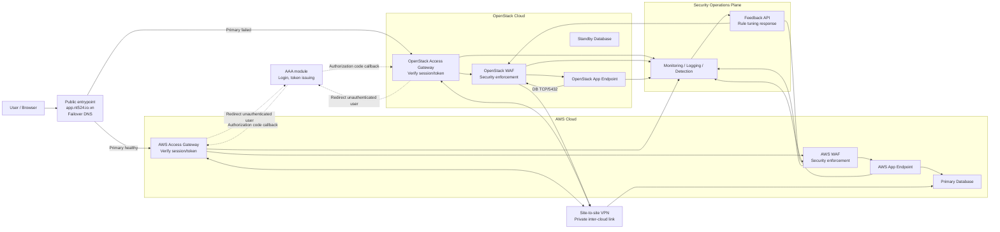

# Hybrid Cloud NAC/WAF/App/DB Lab

Ngày cập nhật: 2026-05-30

## Cập nhật mới nhất

- OpenStack đã được triển khai lại thành công với:
  - `vpn_public_ip`: `172.10.10.209`
  - `waf_node_ip`: `10.0.2.10`
  - `app_node_ip`: `10.0.1.214`
- Terraform AWS đã cập nhật Route 53 secondary failover record từ `172.10.10.208` sang `172.10.10.209`.
- Terraform AWS đã cập nhật security group của AWS VPN để cho phép WireGuard UDP `51820` từ WAN IP hiện tại `113.178.207.9/32`.
- Terraform state của cả `terraform/aws` và `terraform/openstack` đã được migrate lên S3 backend:
  - S3 bucket: `nt524-terraform-state-211116632423-ap-southeast-1`
  - DynamoDB lock table: `nt524-terraform-locks`
- AWS key hiện dùng cho Ansible/Terraform local là `~/.ssh/vpn_key` và `~/.ssh/vpn_key.pub`.
- Ansible inventory thật nằm tại `ansible/inventories/production/hosts.yml`.
- Terraform AWS đã tạo EC2 `aws-db-node` riêng trên AWS, chạy PostgreSQL primary.
- AWS DB private IP: `172.31.3.61`.
- AWS app và OpenStack app đều đang trỏ `DATABASE_URL` về AWS DB primary `172.31.3.61`.
- OpenStack DB đã được loại khỏi topology. OpenStack app bắt buộc đi DB theo luồng `OpenStack App -> OpenStack WAF -> OpenStack VPN -> AWS VPN -> AWS DB`.
- OpenStack WAF ghi log riêng các request TCP/5432 từ OpenStack app tới AWS DB vào `siem-db-flow-*`.
- WireGuard site-to-site đã cập nhật thành công bằng key mới và đã thêm TCP MSS clamp để tránh kẹt kết nối PostgreSQL/logging qua tunnel. Public key WireGuard của OpenStack VPN là:

```text
gaGs+OT8PGNs1PCvhcYtPwVyCfjJ+B3ZYqrYqLCiRHc=
```

Public key này hiện đã được cấu hình ở peer `aws-vpn`.

## Tổng quan

Repo này triển khai lab hybrid cloud gồm AWS và OpenStack, có NAC bằng Amazon Cognito, WAF ModSecurity/OWASP CRS ở cả hai cloud, app Flask nhẹ, PostgreSQL primary trên AWS, SIEM/ELK, và Route 53 DNS failover/failback.

Tài liệu liên quan:

- `docs/devsecops-phases.md`: giải thích project tập trung vào stage nào trong DevSecOps, và chi tiết Monitoring, Logging, Detect, Response.
- `docs/feedback-api.md`: cách dùng Feedback API, dataset label flow và export tuned WAF rules.

## Trạng Thái Hiện Tại

Entrypoint public:

```text
https://app.nt524.io.vn/
```

Hiện tại browser sẽ cần accept warning TLS vì gateway đang dùng self-signed certificate cho lab HTTPS.

Đã hoàn thành:

- Route 53 failover DNS cho `app.nt524.io.vn`.
- Amazon Cognito Hosted UI + `oauth2-proxy` + Nginx `auth_request` trên gateway.
- AWS gateway và OpenStack gateway đều enforce login trước khi vào WAF/app.
- AWS WAF và OpenStack WAF dùng Nginx + ModSecurity v3 + OWASP CRS.
- AWS app và OpenStack app cùng chạy Lightweight Flask Auth App.
- PostgreSQL chạy single-primary trên AWS DB; OpenStack app truy cập AWS DB qua WAF/VPN để có thể monitor/log/detect DB flow.
- WireGuard site-to-site VPN giữa AWS và OpenStack.
- SIEM/ELK logging pipeline với Filebeat trên gateway/WAF/app/VPN nodes.
- Feedback API cho WAF payload review, dataset label và export tuned ModSecurity rules.
- Đã bỏ GitHub Actions cũ; rule/image update hiện được vận hành từ controller bằng local tooling và Ansible.
- Test SQLi qua gateway/WAF trả HTTP `403`.
- Test Route 53 failover/failback thành công sau khi thêm Cognito.

Còn cần làm:

- Thay self-signed gateway TLS cert bằng Let's Encrypt/public TLS cert.
- Giảm rủi ro public WAN IP OpenStack/laptop thay đổi làm WireGuard SG chặn tunnel.
- Nếu cần, tách health endpoint gateway riêng thay vì proxy `/healthz` của app.

## Kiến Trúc

### Hình 1 - Kiến Trúc Tổng Thể

Hình này thể hiện luồng logic tổng thể, không đi sâu vào dịch vụ cụ thể trên từng node.



Tóm tắt control plane và app plane:

- Control plane: `Route 53`, `AAA`, access gateway, WAF, monitoring/logging/detection, feedback/rule response.
- App plane: AWS app endpoint, OpenStack app endpoint, AWS primary database. OpenStack không còn DB node.

### Hình 2 - Kiến Trúc Triển Khai

Hình này ánh xạ Hình 1 vào các node, IP và công nghệ đang chạy trong lab.

```mermaid
flowchart LR
    User["User / Browser"]
    R53["Route 53 Failover DNS<br/>app.nt524.io.vn<br/>TTL 30s<br/>Health check /healthz"]
    Cognito["Amazon Cognito Hosted UI<br/>User Pool: hybrid-auth-users<br/>OIDC authorization code flow"]

    subgraph AWS["AWS Cloud"]
        AWS_GW["aws-gateway<br/>Public IP: 122.248.227.98<br/>Nginx + oauth2-proxy<br/>Self-signed HTTPS"]
        AWS_WAF["aws-waf<br/>Private IP: 172.31.4.221<br/>Nginx + ModSecurity v3<br/>OWASP CRS + tuned rules"]
        AWS_APP["aws-app<br/>Private IP: 172.31.8.161<br/>Lightweight Flask Auth App"]
        AWS_DB["aws-db<br/>Private IP: 172.31.3.61<br/>PostgreSQL primary"]
        AWS_VPN["aws-vpn<br/>Public IP: 54.169.109.49<br/>WireGuard 10.200.0.1"]
    end

    subgraph OPENSTACK["OpenStack Cloud"]
        OS_GW["openstack-gateway<br/>Floating IP: 172.10.10.209<br/>Nginx + oauth2-proxy<br/>Also VPN gateway"]
        OS_WAF["openstack-waf<br/>Transit IP: 10.0.2.10<br/>App-net IP: 10.0.1.254<br/>Nginx + ModSecurity v3<br/>OWASP CRS + tuned rules"]
        OS_APP["openstack-app<br/>Private IP: 10.0.1.214<br/>Lightweight Flask Auth App"]
        OS_VPN["WireGuard on gateway<br/>Transit IP: 10.0.2.254<br/>WireGuard 10.200.0.2"]
    end

    subgraph SIEM["Monitoring / SIEM / Response"]
        Filebeat["Filebeat agents<br/>gateway, WAF, app logs"]
        Logstash["Logstash<br/>VPN listener 10.0.2.254:5044"]
        ES["Elasticsearch<br/>172.10.10.1:9200"]
        Kibana["Kibana dashboards"]
        Feedback["Feedback API<br/>Review blocked payloads<br/>Update datasets"]
        ML["ML tuning pipeline<br/>Export RESPONSE-999 rules"]
    end

    User --> R53
    R53 -->|"Primary"| AWS_GW
    R53 -->|"Secondary"| OS_GW

    AWS_GW -. "Unauthenticated redirect" .-> Cognito
    OS_GW -. "Unauthenticated redirect" .-> Cognito
    Cognito -. "Callback /oauth2/callback" .-> AWS_GW
    Cognito -. "Callback /oauth2/callback" .-> OS_GW

    AWS_GW --> AWS_WAF --> AWS_APP
    OS_GW --> OS_WAF --> OS_APP

    AWS_APP -->|"DATABASE_URL TCP/5432"| AWS_DB
    OS_APP -->|"DATABASE_URL TCP/5432"| OS_WAF
    AWS_VPN <-->|"WireGuard tunnel"| OS_VPN
    OS_VPN -->|"gateway proxy traffic"| OS_WAF
    OS_WAF -->|"DB flow log + route to AWS DB"| OS_VPN
    AWS_VPN --> AWS_DB

    AWS_GW --> Filebeat
    OS_GW --> Filebeat
    AWS_WAF --> Filebeat
    OS_WAF --> Filebeat
    AWS_APP --> Filebeat
    OS_APP --> Filebeat
    Filebeat --> Logstash --> ES --> Kibana
    ES --> Feedback --> ML
    ML --> AWS_WAF
    ML --> OS_WAF
```



Important traffic rules:

- User hợp lệ đi qua `Gateway -> WAF -> App`.
- App public HTTP trên AWS bị chặn; user không đi trực tiếp vào app.
- AWS WAF không còn public EIP; chỉ nhận traffic từ AWS gateway/private network.
- OpenStack public entrypoint hiện dùng `vpn-gateway` kiêm gateway proxy.
- `/healthz` trên gateway để public để Route 53 health check không bị redirect login.
- AWS route table hiện route cả `10.0.1.0/24` và `10.0.2.0/24` qua AWS VPN ENI để app DB traffic và Filebeat/Logstash traffic đều đi được qua VPN.

## Địa Chỉ Hiện Tại

DNS/domain:

```text
FQDN: app.nt524.io.vn
Primary: AWS gateway 122.248.227.98
Secondary: OpenStack gateway 172.10.10.209
TTL: 30s
Route 53 health check path: /healthz
Route 53 health check ID: f8c7d0d4-b6fc-4311-b5bd-2c5fe44e3ed9
```

Route 53 nameservers cho `nt524.io.vn`:

```text
ns-1270.awsdns-30.org
ns-2018.awsdns-60.co.uk
ns-385.awsdns-48.com
ns-916.awsdns-50.net
```

OpenStack:

```text
vpn_public_ip: 172.10.10.209
waf_node_ip: 10.0.2.10
app_node_ip: 10.0.1.214
waf transit CIDR: 10.0.2.0/24
app CIDR: 10.0.1.0/24
```

AWS:

```text
gateway_public_ip: 122.248.227.98
vpn_public_ip: 54.169.109.49
waf_private_ip: 172.31.4.221
app_private_ip: 172.31.8.161
app_public_ip: 13.212.148.187
db_private_ip: 172.31.3.61
ECR WAF image: 211116632423.dkr.ecr.ap-southeast-1.amazonaws.com/my-waf-nginx:latest
```

Cognito:

```text
User Pool: hybrid-auth-users
User Pool ID: ap-southeast-1_Xg1Q3ZUP9
App Client: hybrid-auth-gateway
App Client ID: 4gn2j0lo07rori6u3snjj6lr4p
Hosted UI: https://nt524-hybrid-auth-211116632423.auth.ap-southeast-1.amazoncognito.com
Callback URL: https://app.nt524.io.vn/oauth2/callback
Logout URL: https://app.nt524.io.vn/
```

Demo user:

```text
Email: demo@nt524.io.vn
Password: DemoPass123
```

## Repo Structure

```text
terraform/openstack/        OpenStack networks, gateway, WAF, app, DB nodes
terraform/aws/              AWS EC2, SG, ECR, Route 53, Cognito
ansible/gateway.yml         Deploy public gateways and oauth2-proxy
ansible/network_vpn.yml     Deploy WireGuard/routing
ansible/waf.yml             Deploy WAF on AWS/OpenStack
ansible/app.yml             Deploy PostgreSQL and Flask app
ansible/roles/gateway_proxy Nginx gateway + oauth2-proxy role
ansible/roles/nginx_waf     Nginx/ModSecurity/CRS WAF role
ansible/roles/simple_auth_app Flask app role
ansible/roles/postgresql_centralized PostgreSQL role
elk/                        Local ELK/SIEM stack
docs/devsecops-phases.md    DevSecOps phase mapping và Monitoring/Logging/Detect/Response
docs/feedback-api.md        Feedback API và ML/WAF tuning workflow
docs/task.md                Detailed task log and latest operational notes
docs/1.md                   Architecture/design plan
```

## Triển Khai Và Vận Hành

### Terraform OpenStack

```bash
source /etc/kolla/admin-openrc.sh
terraform -chdir=terraform/openstack init
terraform -chdir=terraform/openstack plan
terraform -chdir=terraform/openstack apply
terraform -chdir=terraform/openstack output
```

Nếu recreate OpenStack, cập nhật lại IP trong:

```text
ansible/inventories/production/hosts.yml
ansible/inventories/production/group_vars/all.yml
terraform/aws/terraform.tfvars
```

### Terraform AWS

Cập nhật `terraform/aws/terraform.tfvars`:

```hcl
aws_region = "ap-southeast-1"
vpc_id = "vpc-..."
subnet_id = "subnet-..."
route_table_id = "rtb-..."
openstack_vpn_public_cidr = "<WAN_PUBLIC_IP>/32"
public_key_path = "~/.ssh/vpn_key.pub"

route53_failover_enabled     = true
route53_create_hosted_zone   = true
route53_zone_name            = "nt524.io.vn"
route53_record_name          = "app"
route53_secondary_gateway_ip = "172.10.10.209"
route53_health_check_path    = "/healthz"

cognito_enabled         = true
cognito_user_pool_name  = "hybrid-auth-users"
cognito_app_client_name = "hybrid-auth-gateway"
cognito_domain_prefix   = "nt524-hybrid-auth-211116632423"
```

Apply:

```bash
terraform -chdir=terraform/aws init
terraform -chdir=terraform/aws plan
terraform -chdir=terraform/aws apply
terraform -chdir=terraform/aws output
```

Sau khi tạo Cognito, lấy client secret cho `oauth2-proxy`:

```bash
terraform -chdir=terraform/aws output -raw cognito_user_pool_client_id
terraform -chdir=terraform/aws output -raw cognito_user_pool_client_secret
terraform -chdir=terraform/aws output -raw cognito_issuer_url
```

Cập nhật các giá trị này trong:

```text
ansible/inventories/production/group_vars/all.yml
```

### Build/Push WAF Image

GitHub Actions workflow cũ đã bị gỡ bỏ vì không còn phù hợp topology hiện tại: workflow chỉ deploy AWS WAF, dùng path/template cũ và GitHub runner không reach được OpenStack WAF/private path. Hiện tại build/push image chỉ cần làm khi thay đổi Dockerfile/base WAF image; sau đó deploy bằng Ansible.

```bash
aws ecr get-login-password --region ap-southeast-1 \
  | docker login --username AWS --password-stdin 211116632423.dkr.ecr.ap-southeast-1.amazonaws.com

docker build --network=host \
  -t 211116632423.dkr.ecr.ap-southeast-1.amazonaws.com/my-waf-nginx:latest \
  -f ansible/roles/nginx_waf/files/Dockerfile \
  ansible/roles/nginx_waf/files/

docker push 211116632423.dkr.ecr.ap-southeast-1.amazonaws.com/my-waf-nginx:latest
```

Nếu chỉ retrain/export ModSecurity rule từ Feedback API/ML thì không cần build lại image ECR. Chỉ cập nhật file rule và reload WAF bằng Ansible:

```bash
cd /home/deployer/Downloads/Project/modsec-learn
~/modsec-ai-venv/bin/python ../scripts/run_training.py
~/modsec-ai-venv/bin/python ../scripts/export_tuned_rules.py \
  --model linear_svc_pl4_l1.joblib \
  --threshold 1e-5

cd /home/deployer/Downloads/Project
ANSIBLE_LOCAL_TEMP=/tmp/ansible-local \
ANSIBLE_SSH_CONTROL_PATH_DIR=/tmp/ansible-cp \
/home/deployer/kolla-venv/bin/ansible-playbook \
  -i ansible/inventories/production/hosts.yml \
  ansible/waf.yml \
  --tags update_rules
```

Lệnh `--tags update_rules` copy `RESPONSE-999-EXCLUSION-RULES-AFTER-CRS.conf` lên cả AWS WAF và OpenStack WAF, sau đó reload Nginx trong container WAF.

### Ansible

Dùng virtualenv Ansible hiện tại:

```bash
export ANSIBLE_LOCAL_TEMP=/tmp/ansible-local
export ANSIBLE_SSH_CONTROL_PATH_DIR=/tmp/ansible-cp
```

Syntax-check:

```bash
/home/deployer/kolla-venv/bin/ansible-playbook -i ansible/inventories/production/hosts.yml ansible/network_vpn.yml --syntax-check
/home/deployer/kolla-venv/bin/ansible-playbook -i ansible/inventories/production/hosts.yml ansible/waf.yml --syntax-check
/home/deployer/kolla-venv/bin/ansible-playbook -i ansible/inventories/production/hosts.yml ansible/app.yml --syntax-check
/home/deployer/kolla-venv/bin/ansible-playbook -i ansible/inventories/production/hosts.yml ansible/gateway.yml --syntax-check
```

Deploy theo thứ tự:

```bash
/home/deployer/kolla-venv/bin/ansible-playbook -i ansible/inventories/production/hosts.yml ansible/network_vpn.yml
/home/deployer/kolla-venv/bin/ansible-playbook -i ansible/inventories/production/hosts.yml ansible/app.yml
/home/deployer/kolla-venv/bin/ansible-playbook -i ansible/inventories/production/hosts.yml ansible/waf.yml
/home/deployer/kolla-venv/bin/ansible-playbook -i ansible/inventories/production/hosts.yml ansible/gateway.yml
```

## Kiểm Tra Nhanh

DNS:

```bash
dig +short @ns-1270.awsdns-30.org app.nt524.io.vn A
dig +short app.nt524.io.vn A
```

Gateway health:

```bash
curl -fsS http://122.248.227.98/healthz
curl -fsS http://172.10.10.209/healthz
curl -k -fsS https://app.nt524.io.vn/healthz
```

Auth redirect:

```bash
curl -k -I https://app.nt524.io.vn/
```

Kết quả đúng là `302` sang Cognito Hosted UI khi chưa login.

## Test End-to-End Cho Người Dùng

Luồng browser cần test:

1. Mở cửa sổ ẩn danh.
2. Vào `https://app.nt524.io.vn/`.
3. Kỳ vọng: gateway redirect sang Amazon Cognito Hosted UI vì chưa có session.
4. Chọn tạo tài khoản hoặc đăng nhập bằng user demo.
5. Sau callback `/oauth2/callback`, browser vào được `Hybrid Auth App`.
6. Tạo một private note để sinh dữ liệu DB.
7. Đóng tab, mở lại `https://app.nt524.io.vn/` trong cùng browser profile.
8. Kỳ vọng: không phải nhập lại mật khẩu vì cookie `_hybrid_auth` của `oauth2-proxy` vẫn còn hợp lệ.
9. Nhấn `Sign out`.
10. Kỳ vọng: app redirect qua `/oauth2/sign_out`, clear cookie `oauth2-proxy`, gọi Cognito `/logout`, rồi quay lại URL public và yêu cầu login lại.

Lưu ý: nếu chỉ gọi `/logout` trong app mà không đi qua `/oauth2/sign_out`, gateway sẽ lập tức xác thực lại bằng cookie/token cũ. Source hiện tại đã cấu hình Sign Out theo chuỗi đúng:

```text
App /logout -> /oauth2/sign_out -> Cognito /logout -> https://app.nt524.io.vn/
```

Kiểm tra người dùng vào được web ở cả hai cloud:

```bash
curl -fsS http://122.248.227.98/healthz
curl -fsS http://172.10.10.209/healthz
curl -k -fsS https://app.nt524.io.vn/healthz
```

Với browser, cách dễ nhất là test bình thường qua domain cho AWS primary, sau đó tạm fail AWS gateway hoặc sửa hosts local trỏ `app.nt524.io.vn` về `172.10.10.209` để test OpenStack gateway. Không truy cập trực tiếp IP bằng browser cho OAuth flow chính thức, vì Cognito callback/logout URL đang đăng ký theo hostname `https://app.nt524.io.vn`.

SQLi WAF test:

```bash
cd ansible
ANSIBLE_LOCAL_TEMP=/tmp/ansible-local \
ANSIBLE_REMOTE_TEMP=/tmp/ansible-remote \
ANSIBLE_SSH_CONTROL_PATH_DIR=/tmp/ansible-cp \
ansible -i inventories/production/hosts.yml 'aws-waf:openstack-waf' -b -m shell \
  -a 'curl -o /tmp/sqli.out -s -w "%{http_code}\n" "http://127.0.0.1/?id=1%20OR%201=1"'
```

Kết quả kỳ vọng: `403`.

Nếu test qua `https://app.nt524.io.vn/` khi chưa đăng nhập, kết quả đúng sẽ là `302` sang Cognito trước khi request đi tới WAF. Muốn test WAF qua public domain thì cần thực hiện trong browser/curl đã có cookie đăng nhập hợp lệ.

XSS WAF test:

```bash
cd ansible
ANSIBLE_LOCAL_TEMP=/tmp/ansible-local \
ANSIBLE_REMOTE_TEMP=/tmp/ansible-remote \
ANSIBLE_SSH_CONTROL_PATH_DIR=/tmp/ansible-cp \
ansible -i inventories/production/hosts.yml 'aws-waf:openstack-waf' -b -m shell \
  -a 'curl -o /tmp/xss.out -s -w "%{http_code}\n" "http://127.0.0.1/?q=%3Cscript%3Ealert(1)%3C%2Fscript%3E"'
```

Kết quả kỳ vọng: `403`. Log sẽ vào `siem-waf-access-*` và hiện trong Kibana dashboard `WAF Security - Attack & False Positive Review`.

Kiểm tra AWS DB và log flow DB từ OpenStack app:

```bash
cd ansible
ANSIBLE_LOCAL_TEMP=/tmp/ansible-local \
ANSIBLE_REMOTE_TEMP=/tmp/ansible-remote \
ANSIBLE_SSH_CONTROL_PATH_DIR=/tmp/ansible-cp \
ansible -i inventories/production/hosts.yml aws-db -b -m shell \
  -a 'docker exec hybrid-auth-postgres psql -U hybrid_auth -d hybrid_auth -c "select inet_server_addr(), pg_is_in_recovery();"'

ANSIBLE_LOCAL_TEMP=/tmp/ansible-local \
ANSIBLE_REMOTE_TEMP=/tmp/ansible-remote \
ANSIBLE_SSH_CONTROL_PATH_DIR=/tmp/ansible-cp \
ansible -i inventories/production/hosts.yml openstack-app -b -m shell \
  -a 'curl -fsS http://127.0.0.1/healthz'

ANSIBLE_LOCAL_TEMP=/tmp/ansible-local \
ANSIBLE_REMOTE_TEMP=/tmp/ansible-remote \
ANSIBLE_SSH_CONTROL_PATH_DIR=/tmp/ansible-cp \
ansible -i inventories/production/hosts.yml openstack-waf -b -m shell \
  -a 'tail -n 20 /var/log/openstack-db-flow.log'
```

Kết quả đúng:

- `aws-db`: `pg_is_in_recovery = f`.
- `openstack-waf`: thấy log prefix `OPENSTACK_APP_TO_AWS_DB` với `SRC=10.0.1.214`, `DST=172.31.3.61`, `DPT=5432`.

Route 53 health check:

```bash
aws route53 get-health-check-status \
  --health-check-id f8c7d0d4-b6fc-4311-b5bd-2c5fe44e3ed9 \
  --query 'HealthCheckObservations[].StatusReport.Status' \
  --output text
```

## Test Failover/Failback

Failover:

```bash
/home/deployer/kolla-venv/bin/ansible -i ansible/inventories/production/hosts.yml \
  aws-gateway -b -m systemd -a 'name=nginx state=stopped'

dig +short @ns-1270.awsdns-30.org app.nt524.io.vn A
curl -fsS http://172.10.10.209/healthz
```

Kết quả kỳ vọng sau khi Route 53 health check fail:

```text
app.nt524.io.vn -> 172.10.10.209
```

Failback:

```bash
/home/deployer/kolla-venv/bin/ansible -i ansible/inventories/production/hosts.yml \
  aws-gateway -b -m systemd -a 'name=nginx state=started enabled=true'

dig +short @ns-1270.awsdns-30.org app.nt524.io.vn A
curl -fsS http://122.248.227.98/healthz
```

Kết quả kỳ vọng:

```text
app.nt524.io.vn -> 122.248.227.98
```

Lần test gần nhất ngày 2026-05-27 đã thành công: DNS failover sang OpenStack, sau đó failback về AWS; Route 53 health check cuối test `8/8 Success`.

## ELK/SIEM

Chạy ELK local:

```bash
cd elk
sudo sysctl -w vm.max_map_count=262144
sudo docker compose up -d --remove-orphans
python3 kibana/provision_kibana.py
```

Logging hiện dùng Filebeat -> Logstash -> Elasticsearch -> Kibana. Dashboard đã có các view tổng quan, WAF/security, service health và response operations; có thể tiếp tục mở rộng thêm field để phân biệt ingress, east-west, failover và failback chi tiết hơn.

Logstash listener:

```text
openstack-vpn 10.0.2.254:5044
```

Filebeat hiện thu log từ:

- Gateway nodes: Nginx gateway access/error log và syslog.
- WAF nodes: Docker/Nginx/ModSecurity log và syslog.
- App nodes: Docker app log và syslog.
- VPN nodes: syslog/WireGuard/system events.

Dashboard được provision bởi `elk/kibana/provision_kibana.py`:

- `SIEM Hybrid Overview`: tổng quan log volume theo thời gian, host và role.
- `Service Health - Load & Error Monitoring`: monitoring request throughput, 5xx, syslog high severity và log volume.
- `WAF Security - Attack & False Positive Review`: detect WAF block/403, top IP/path và detail cho feedback.
- `Response Operations - WAF/Auth/Infra`: response queue cho WAF block, 5xx, auth/gateway/VPN/syslog events.

Mapping chi tiết giữa Monitoring, Logging, Detect và Response nằm trong:

```text
docs/devsecops-phases.md
```

Feedback API va ML/WAF tuning loop:

```bash
FEEDBACK_ML_PYTHON=~/modsec-ai-venv/bin/python python3 scripts/feedback_api.py
```

```text
Dashboard: http://127.0.0.1:5005/
Health:    http://127.0.0.1:5005/healthz
Docs:      docs/feedback-api.md
```

## Lưu Ý Vận Hành

- `openstack_vpn_public_cidr` phải là WAN/NAT public IP thật của laptop/OpenStack AIO, không phải floating IP `172.10.10.x`.
- Nếu WAN IP đổi, AWS WireGuard SG sẽ chặn tunnel cho đến khi cập nhật `openstack_vpn_public_cidr` và `terraform apply`.
- Trạng thái hiện tại: App AWS và OpenStack dùng AWS PostgreSQL primary. OpenStack DB đã bỏ; không còn promote/failover DB sang OpenStack.
- `/healthz` không bị auth để Route 53 health check có thể đánh giá gateway/app path.
- Self-signed TLS cert chỉ phù hợp lab. Khi dùng browser/demo chính thức nên cấp public cert.
- Chi tiết lịch sử thay đổi nằm trong `docs/task.md`.
