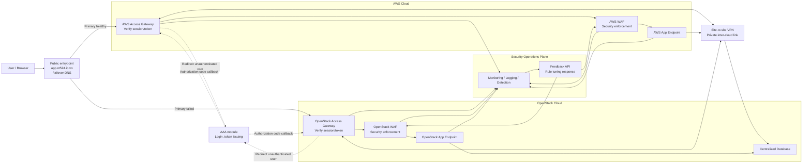

# Hybrid Cloud NAC/WAF/App/DB Lab

Ngay cap nhat: 2026-05-29

Repo nay trien khai lab hybrid cloud gom AWS va OpenStack, co NAC bang Amazon Cognito, WAF ModSecurity/OWASP CRS o ca hai cloud, app Flask nhe, PostgreSQL centralized tren OpenStack, SIEM/ELK, va Route 53 DNS failover/failback.

Doc lien quan:

- `docs/devsecops-phases.md`: giai thich project tap trung vao stage nao trong DevSecOps, va chi tiet Monitoring, Logging, Detect, Response.
- `docs/feedback-api.md`: cach dung Feedback API, dataset label flow va export tuned WAF rules.

## Trang Thai Hien Tai

Entrypoint public:

```text
https://app.nt524.io.vn/
```

Hien tai browser se can accept warning TLS vi gateway dang dung self-signed certificate cho lab HTTPS.

Da hoan thanh:

- Route 53 failover DNS cho `app.nt524.io.vn`.
- Amazon Cognito Hosted UI + `oauth2-proxy` + Nginx `auth_request` tren gateway.
- AWS gateway va OpenStack gateway deu enforce login truoc khi vao WAF/app.
- AWS WAF va OpenStack WAF dung Nginx + ModSecurity v3 + OWASP CRS.
- AWS app va OpenStack app cung chay Lightweight Flask Auth App.
- PostgreSQL centralized nam tren OpenStack DB node.
- WireGuard site-to-site VPN giua AWS va OpenStack.
- SIEM/ELK logging pipeline voi Filebeat tren gateway/WAF/app/VPN nodes.
- Feedback API cho WAF payload review, dataset label va export tuned ModSecurity rules.
- Da bo GitHub Actions cu; rule/image update hien duoc van hanh tu controller bang local tooling va Ansible.
- Test SQLi qua gateway/WAF tra HTTP `403`.
- Test Route 53 failover/failback thanh cong sau khi them Cognito.

Con can lam:

- Thay self-signed gateway TLS cert bang Let's Encrypt/public TLS cert.
- Giam rui ro public WAN IP OpenStack/laptop thay doi lam WireGuard SG chan tunnel.
- Neu can, tach health endpoint gateway rieng thay vi proxy `/healthz` cua app.

## Kien Truc

### Hinh 1 - Kien Truc Tong The

Hinh nay the hien luong logic tong the, khong di sau vao dich vu cu the tren tung node.



Tom tat control plane va app plane:

- Control plane: `Route 53`, `AAA`, access gateway, WAF, monitoring/logging/detection, feedback/rule response.
- App plane: AWS app endpoint, OpenStack app endpoint, centralized database.

### Hinh 2 - Kien Truc Trien Khai

Hinh nay anh xa Hinh 1 vao cac node, IP va cong nghe dang chay trong lab.

```mermaid
flowchart LR
    User["User / Browser"]
    R53["Route 53 Failover DNS<br/>app.nt524.io.vn<br/>TTL 30s<br/>Health check /healthz"]
    Cognito["Amazon Cognito Hosted UI<br/>User Pool: hybrid-auth-users<br/>OIDC authorization code flow"]

    subgraph AWS["AWS Cloud"]
        AWS_GW["aws-gateway<br/>Public IP: 122.248.227.98<br/>Nginx + oauth2-proxy<br/>Self-signed HTTPS"]
        AWS_WAF["aws-waf<br/>Private IP: 172.31.4.221<br/>Nginx + ModSecurity v3<br/>OWASP CRS + tuned rules"]
        AWS_APP["aws-app<br/>Private IP: 172.31.8.161<br/>Lightweight Flask Auth App"]
        AWS_VPN["aws-vpn<br/>Public IP: 54.169.109.49<br/>WireGuard 10.200.0.1"]
    end

    subgraph OPENSTACK["OpenStack Cloud"]
        OS_GW["openstack-gateway<br/>Floating IP: 172.10.10.208<br/>Nginx + oauth2-proxy<br/>Also VPN gateway"]
        OS_WAF["openstack-waf<br/>Transit IP: 10.0.2.10<br/>App-net IP: 10.0.1.254<br/>Nginx + ModSecurity v3<br/>OWASP CRS + tuned rules"]
        OS_APP["openstack-app<br/>Private IP: 10.0.1.244<br/>Lightweight Flask Auth App"]
        OS_DB["openstack-db<br/>Private IP: 10.0.1.94<br/>PostgreSQL centralized"]
        OS_VPN["WireGuard on gateway<br/>Transit IP: 10.0.2.254<br/>WireGuard 10.200.0.2"]
    end

    subgraph SIEM["Monitoring / SIEM / Response"]
        Filebeat["Filebeat agents<br/>gateway, WAF, app logs"]
        Logstash["Logstash<br/>VPN listener 10.0.2.254:5044"]
        ES["Elasticsearch<br/>172.10.10.1:9200"]
        Kibana["Kibana dashboards"]
        Feedback["Feedback API<br/>Review blocked payloads<br/>Update datasets"]
        ML["ML tuning pipeline<br/>Export RESPONSE-999 rules"]
    end

    User --> R53
    R53 -->|"Primary"| AWS_GW
    R53 -->|"Secondary"| OS_GW

    AWS_GW -. "Unauthenticated redirect" .-> Cognito
    OS_GW -. "Unauthenticated redirect" .-> Cognito
    Cognito -. "Callback /oauth2/callback" .-> AWS_GW
    Cognito -. "Callback /oauth2/callback" .-> OS_GW

    AWS_GW --> AWS_WAF --> AWS_APP
    OS_GW --> OS_WAF --> OS_APP

    AWS_APP -->|"DATABASE_URL over VPN"| AWS_VPN
    AWS_VPN <-->|"WireGuard tunnel"| OS_VPN
    OS_VPN --> OS_WAF
    AWS_APP --> OS_DB
    OS_APP --> OS_DB

    AWS_GW --> Filebeat
    OS_GW --> Filebeat
    AWS_WAF --> Filebeat
    OS_WAF --> Filebeat
    AWS_APP --> Filebeat
    OS_APP --> Filebeat
    Filebeat --> Logstash --> ES --> Kibana
    ES --> Feedback --> ML
    ML --> AWS_WAF
    ML --> OS_WAF
```



Important traffic rules:

- User hop le di qua `Gateway -> WAF -> App`.
- App public HTTP tren AWS bi chan; user khong di truc tiep vao app.
- AWS WAF khong con public EIP; chi nhan traffic tu AWS gateway/private network.
- OpenStack public entrypoint hien dung `vpn-gateway` kiem gateway proxy.
- `/healthz` tren gateway de public de Route 53 health check khong bi redirect login.
- AWS route table hien route ca `10.0.1.0/24` va `10.0.2.0/24` qua AWS VPN ENI de app DB traffic va Filebeat/Logstash traffic deu di duoc qua VPN.

## Dia Chi Hien Tai

DNS/domain:

```text
FQDN: app.nt524.io.vn
Primary: AWS gateway 122.248.227.98
Secondary: OpenStack gateway 172.10.10.208
TTL: 30s
Route 53 health check path: /healthz
Route 53 health check ID: f8c7d0d4-b6fc-4311-b5bd-2c5fe44e3ed9
```

Route 53 nameservers cho `nt524.io.vn`:

```text
ns-1270.awsdns-30.org
ns-2018.awsdns-60.co.uk
ns-385.awsdns-48.com
ns-916.awsdns-50.net
```

OpenStack:

```text
vpn_public_ip: 172.10.10.208
waf_node_ip: 10.0.2.10
app_node_ip: 10.0.1.244
db_node_ip: 10.0.1.94
waf transit CIDR: 10.0.2.0/24
app/db CIDR: 10.0.1.0/24
```

AWS:

```text
gateway_public_ip: 122.248.227.98
vpn_public_ip: 54.169.109.49
waf_private_ip: 172.31.4.221
app_private_ip: 172.31.8.161
app_public_ip: 13.212.148.187
ECR WAF image: 211116632423.dkr.ecr.ap-southeast-1.amazonaws.com/my-waf-nginx:latest
```

Cognito:

```text
User Pool: hybrid-auth-users
User Pool ID: ap-southeast-1_Xg1Q3ZUP9
App Client: hybrid-auth-gateway
App Client ID: 4gn2j0lo07rori6u3snjj6lr4p
Hosted UI: https://nt524-hybrid-auth-211116632423.auth.ap-southeast-1.amazoncognito.com
Callback URL: https://app.nt524.io.vn/oauth2/callback
Logout URL: https://app.nt524.io.vn/
```

Demo user:

```text
Email: demo@nt524.io.vn
Password: DemoPass123
```

## Repo Structure

```text
terraform/openstack/        OpenStack networks, gateway, WAF, app, DB nodes
terraform/aws/              AWS EC2, SG, ECR, Route 53, Cognito
ansible/gateway.yml         Deploy public gateways and oauth2-proxy
ansible/network_vpn.yml     Deploy WireGuard/routing
ansible/waf.yml             Deploy WAF on AWS/OpenStack
ansible/app.yml             Deploy PostgreSQL and Flask app
ansible/roles/gateway_proxy Nginx gateway + oauth2-proxy role
ansible/roles/nginx_waf     Nginx/ModSecurity/CRS WAF role
ansible/roles/simple_auth_app Flask app role
ansible/roles/postgresql_centralized PostgreSQL role
elk/                        Local ELK/SIEM stack
docs/devsecops-phases.md    DevSecOps phase mapping va Monitoring/Logging/Detect/Response
docs/feedback-api.md        Feedback API va ML/WAF tuning workflow
docs/task.md                Detailed task log and latest operational notes
docs/1.md                   Architecture/design plan
```

## Trien Khai Va Van Hanh

### Terraform OpenStack

```bash
source /etc/kolla/admin-openrc.sh
terraform -chdir=terraform/openstack init
terraform -chdir=terraform/openstack plan
terraform -chdir=terraform/openstack apply
terraform -chdir=terraform/openstack output
```

Neu recreate OpenStack, cap nhat lai IP trong:

```text
ansible/inventories/production/hosts.yml
ansible/inventories/production/group_vars/all.yml
terraform/aws/terraform.tfvars
```

### Terraform AWS

Cap nhat `terraform/aws/terraform.tfvars`:

```hcl
aws_region = "ap-southeast-1"
vpc_id = "vpc-..."
subnet_id = "subnet-..."
route_table_id = "rtb-..."
openstack_vpn_public_cidr = "<WAN_PUBLIC_IP>/32"
public_key_path = "~/.ssh/vpn_key.pub"

route53_failover_enabled     = true
route53_create_hosted_zone   = true
route53_zone_name            = "nt524.io.vn"
route53_record_name          = "app"
route53_secondary_gateway_ip = "172.10.10.208"
route53_health_check_path    = "/healthz"

cognito_enabled         = true
cognito_user_pool_name  = "hybrid-auth-users"
cognito_app_client_name = "hybrid-auth-gateway"
cognito_domain_prefix   = "nt524-hybrid-auth-211116632423"
```

Apply:

```bash
terraform -chdir=terraform/aws init
terraform -chdir=terraform/aws plan
terraform -chdir=terraform/aws apply
terraform -chdir=terraform/aws output
```

Sau khi tao Cognito, lay client secret cho `oauth2-proxy`:

```bash
terraform -chdir=terraform/aws output -raw cognito_user_pool_client_id
terraform -chdir=terraform/aws output -raw cognito_user_pool_client_secret
terraform -chdir=terraform/aws output -raw cognito_issuer_url
```

Cap nhat cac gia tri nay trong:

```text
ansible/inventories/production/group_vars/all.yml
```

### Build/Push WAF Image

GitHub Actions workflow cu da bi go bo vi khong con phu hop topology hien tai: workflow chi deploy AWS WAF, dung path/template cu va GitHub runner khong reach duoc OpenStack WAF/private path. Hien tai build/push image chi can lam khi thay doi Dockerfile/base WAF image; sau do deploy bang Ansible.

```bash
aws ecr get-login-password --region ap-southeast-1 \
  | docker login --username AWS --password-stdin 211116632423.dkr.ecr.ap-southeast-1.amazonaws.com

docker build --network=host \
  -t 211116632423.dkr.ecr.ap-southeast-1.amazonaws.com/my-waf-nginx:latest \
  -f ansible/roles/nginx_waf/files/Dockerfile \
  ansible/roles/nginx_waf/files/

docker push 211116632423.dkr.ecr.ap-southeast-1.amazonaws.com/my-waf-nginx:latest
```

Neu chi retrain/export ModSecurity rule tu Feedback API/ML thi khong can build lai image ECR. Chi cap nhat file rule va reload WAF bang Ansible:

```bash
cd /home/deployer/Downloads/Project/modsec-learn
~/modsec-ai-venv/bin/python ../scripts/run_training.py
~/modsec-ai-venv/bin/python ../scripts/export_tuned_rules.py \
  --model linear_svc_pl4_l1.joblib \
  --threshold 1e-5

cd /home/deployer/Downloads/Project
ANSIBLE_LOCAL_TEMP=/tmp/ansible-local \
ANSIBLE_SSH_CONTROL_PATH_DIR=/tmp/ansible-cp \
/home/deployer/kolla-venv/bin/ansible-playbook \
  -i ansible/inventories/production/hosts.yml \
  ansible/waf.yml \
  --tags update_rules
```

Lenh `--tags update_rules` copy `RESPONSE-999-EXCLUSION-RULES-AFTER-CRS.conf` len ca AWS WAF va OpenStack WAF, sau do reload Nginx trong container WAF.

### Ansible

Dung virtualenv Ansible hien tai:

```bash
export ANSIBLE_LOCAL_TEMP=/tmp/ansible-local
export ANSIBLE_SSH_CONTROL_PATH_DIR=/tmp/ansible-cp
```

Syntax-check:

```bash
/home/deployer/kolla-venv/bin/ansible-playbook -i ansible/inventories/production/hosts.yml ansible/network_vpn.yml --syntax-check
/home/deployer/kolla-venv/bin/ansible-playbook -i ansible/inventories/production/hosts.yml ansible/waf.yml --syntax-check
/home/deployer/kolla-venv/bin/ansible-playbook -i ansible/inventories/production/hosts.yml ansible/app.yml --syntax-check
/home/deployer/kolla-venv/bin/ansible-playbook -i ansible/inventories/production/hosts.yml ansible/gateway.yml --syntax-check
```

Deploy theo thu tu:

```bash
/home/deployer/kolla-venv/bin/ansible-playbook -i ansible/inventories/production/hosts.yml ansible/network_vpn.yml
/home/deployer/kolla-venv/bin/ansible-playbook -i ansible/inventories/production/hosts.yml ansible/app.yml
/home/deployer/kolla-venv/bin/ansible-playbook -i ansible/inventories/production/hosts.yml ansible/waf.yml
/home/deployer/kolla-venv/bin/ansible-playbook -i ansible/inventories/production/hosts.yml ansible/gateway.yml
```

## Kiem Tra Nhanh

DNS:

```bash
dig +short @ns-1270.awsdns-30.org app.nt524.io.vn A
dig +short app.nt524.io.vn A
```

Gateway health:

```bash
curl -fsS http://122.248.227.98/healthz
curl -fsS http://172.10.10.208/healthz
curl -k -fsS https://app.nt524.io.vn/healthz
```

Auth redirect:

```bash
curl -k -I https://app.nt524.io.vn/
```

Ket qua dung la `302` sang Cognito Hosted UI khi chua login.

SQLi WAF test:

```bash
curl -k -o /dev/null -s -w "%{http_code}\n" \
  "https://app.nt524.io.vn/?id=1%20OR%201=1"
```

Ket qua ky vong: `403`.

Route 53 health check:

```bash
aws route53 get-health-check-status \
  --health-check-id f8c7d0d4-b6fc-4311-b5bd-2c5fe44e3ed9 \
  --query 'HealthCheckObservations[].StatusReport.Status' \
  --output text
```

## Test Failover/Failback

Failover:

```bash
/home/deployer/kolla-venv/bin/ansible -i ansible/inventories/production/hosts.yml \
  aws-gateway -b -m systemd -a 'name=nginx state=stopped'

dig +short @ns-1270.awsdns-30.org app.nt524.io.vn A
curl -fsS http://172.10.10.208/healthz
```

Ket qua ky vong sau khi Route 53 health check fail:

```text
app.nt524.io.vn -> 172.10.10.208
```

Failback:

```bash
/home/deployer/kolla-venv/bin/ansible -i ansible/inventories/production/hosts.yml \
  aws-gateway -b -m systemd -a 'name=nginx state=started enabled=true'

dig +short @ns-1270.awsdns-30.org app.nt524.io.vn A
curl -fsS http://122.248.227.98/healthz
```

Ket qua ky vong:

```text
app.nt524.io.vn -> 122.248.227.98
```

Lan test gan nhat ngay 2026-05-27 da thanh cong: DNS failover sang OpenStack, sau do failback ve AWS; Route 53 health check cuoi test `8/8 Success`.

## ELK/SIEM

Chay ELK local:

```bash
cd elk
sudo sysctl -w vm.max_map_count=262144
sudo docker compose up -d --remove-orphans
python3 kibana/provision_kibana.py
```

Logging hien dung Filebeat -> Logstash -> Elasticsearch -> Kibana. Dashboard can tiep tuc mo rong de phan biet ingress, east-west, failover va failback.

Logstash listener:

```text
openstack-vpn 10.0.2.254:5044
```

Filebeat hien thu log tu:

- Gateway nodes: Nginx gateway access/error log va syslog.
- WAF nodes: Docker/Nginx/ModSecurity log va syslog.
- App nodes: Docker app log va syslog.
- VPN nodes: syslog/WireGuard/system events.

Dashboard duoc provision boi `elk/kibana/provision_kibana.py`:

- `SIEM Hybrid Overview`: tong quan log volume theo thoi gian, host va role.
- `Service Health - Load & Error Monitoring`: monitoring request throughput, 5xx, syslog high severity va log volume.
- `WAF Security - Attack & False Positive Review`: detect WAF block/403, top IP/path va detail cho feedback.
- `Response Operations - WAF/Auth/Infra`: response queue cho WAF block, 5xx, auth/gateway/VPN/syslog events.

Mapping chi tiet giua Monitoring, Logging, Detect va Response nam trong:

```text
docs/devsecops-phases.md
```

Feedback API va ML/WAF tuning loop:

```bash
FEEDBACK_ML_PYTHON=~/modsec-ai-venv/bin/python python3 scripts/feedback_api.py
```

```text
Dashboard: http://127.0.0.1:5005/
Health:    http://127.0.0.1:5005/healthz
Docs:      docs/feedback-api.md
```

## Luu Y Van Hanh

- `openstack_vpn_public_cidr` phai la WAN/NAT public IP that cua laptop/OpenStack AIO, khong phai floating IP `172.10.10.x`.
- Neu WAN IP doi, AWS WireGuard SG se chan tunnel cho den khi cap nhat `openstack_vpn_public_cidr` va `terraform apply`.
- App AWS va OpenStack cung doc/ghi PostgreSQL centralized tren `10.0.1.94`.
- `/healthz` khong bi auth de Route 53 health check co the danh gia gateway/app path.
- Self-signed TLS cert chi phu hop lab. Khi dung browser/demo chinh thuc nen cap public cert.
- Chi tiet lich su thay doi nam trong `docs/task.md`.
