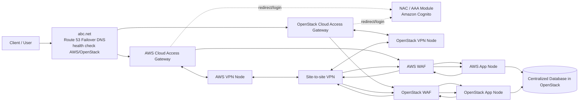

# Plan Hoan Thien Hybrid Cloud NAC, WAF, App Va Database

## 1. Muc Tieu

Project hien tai moi co site-to-site VPN, AWS WAF node, OpenStack app node va ELK/SIEM. Theo feedback kien truc moi can bo sung cac thanh phan sau:

- NAC/AAA module dung Amazon Cognito lam Identity Provider.
- Moi cloud co mot app node rieng.
- Moi cloud co mot WAF rieng.
- WAF khong dat ngay tai NAC, ma dat sau cloud controller/VPN gateway va truoc app node.
- WAF phai bao ve ca traffic public ingress va traffic east-west giua hai cloud.
- Database centralized dat o OpenStack de AWS app va OpenStack app cung doc/ghi du lieu.
- Co co che failover/failback: client chi vao mot DNS chung, vi du `abc.net`, khong can biet dang dung AWS hay OpenStack.

Trong tai lieu nay, "controller" nen duoc hieu la **Cloud Access Gateway**: mot reverse proxy/application gateway do minh trien khai trong tung cloud. No khong phai AWS control plane hay OpenStack controller node that.

### Hinh 1 - Kien Truc Tong The

Hinh nay giong so do feedback ban dau: chi the hien minh se co node nao va node do lam viec gi o muc tong quan.



Ghi chu cho Hinh 1:

- `abc.net / Route 53 Failover DNS`: entrypoint duy nhat cho user; health check quyet dinh tra AWS gateway hay OpenStack gateway.
- `NAC / AAA Module`: xac thuc user, kiem tra session/token, dieu huong login sau khi request da vao gateway duoc DNS chon.
- `Cloud Access Gateway`: nhan request sau NAC, enforce auth/session va route vao WAF local.
- `WAF`: bao ve ca request public ingress va east-west traffic giua 2 app node.
- `App Node`: chay ung dung web co login.
- `Centralized Database`: dat o OpenStack, ca AWS app va OpenStack app cung doc/ghi.
- `Site-to-site VPN`: kenh private giua AWS va OpenStack, dung cho app-to-app va app-to-database traffic.

### Hinh 2 - Kien Truc Trien Khai Va Cong Nghe Su Dung

Hinh nay mo ta trong tung node se dung framework/cong nghe nao.

```mermaid
flowchart LR
    Client[Client Browser / REST Client]
    DNS[abc.net<br/>Route 53 Failover DNS<br/>AWS primary / OpenStack secondary<br/>HTTP health checks]

    subgraph IDP[NAC / Identity Layer]
        Cognito[Amazon Cognito User Pool<br/>Hosted UI<br/>OIDC Authorization Code Flow<br/>JWT ID/Access Token]
    end

    subgraph AWS[AWS Cloud]
        AWS_GW[Cloud Access Gateway<br/>EC2 Ubuntu<br/>Nginx reverse proxy<br/>oauth2-proxy / OIDC auth_request<br/>Filebeat auth/access logs]
        AWS_VPN[VPN Node<br/>WireGuard<br/>iptables routing/NAT]
        AWS_WAF2[WAF Node<br/>Nginx<br/>ModSecurity v3<br/>OWASP CRS<br/>ML tuned exclusion rules<br/>Filebeat WAF logs]
        AWS_APP2[App Node<br/>Docker<br/>Lightweight Flask Auth App<br/>DATABASE_URL to OpenStack PostgreSQL<br/>Filebeat app logs]
    end

    subgraph OPENSTACK[OpenStack Private Cloud]
        OS_GW[Cloud Access Gateway<br/>Ubuntu VM<br/>Nginx reverse proxy<br/>oauth2-proxy / OIDC auth_request<br/>Filebeat auth/access logs]
        OS_VPN[VPN Node<br/>WireGuard<br/>iptables routing/NAT]
        OS_WAF2[WAF Node<br/>Nginx<br/>ModSecurity v3<br/>OWASP CRS<br/>ML tuned exclusion rules<br/>Filebeat WAF logs]
        OS_DB[(PostgreSQL Centralized DB Node<br/>OpenStack private IP<br/>Auth enabled<br/>hybrid_auth database)]
        OS_APP2[App Node<br/>Docker<br/>Lightweight Flask Auth App<br/>Header-based login<br/>DATABASE_URL to PostgreSQL<br/>Filebeat app logs]
    end

    subgraph SIEM[Monitoring / SIEM]
        Logstash[Logstash<br/>VPN/private listener]
        Elasticsearch[Elasticsearch]
        Kibana[Kibana Dashboard<br/>ingress / east-west / failover / failback]
    end

    Client --> DNS
    DNS --> AWS_GW
    DNS --> OS_GW
    AWS_GW -. redirect/login .-> Cognito
    OS_GW -. redirect/login .-> Cognito
    Cognito -. token/callback .-> AWS_GW
    Cognito -. token/callback .-> OS_GW

    AWS_GW --> AWS_WAF2 --> AWS_APP2
    OS_GW --> OS_WAF2 --> OS_APP2

    AWS_VPN <--> OS_VPN
    AWS_APP2 --> AWS_WAF2 --> AWS_VPN
    AWS_VPN --> OS_VPN --> OS_WAF2 --> OS_APP2
    OS_APP2 --> OS_WAF2 --> OS_VPN
    OS_VPN --> AWS_VPN --> AWS_WAF2 --> AWS_APP2

    AWS_APP2 --> OS_DB
    OS_APP2 --> OS_DB

    AWS_GW --> Logstash
    OS_GW --> Logstash
    AWS_WAF2 --> Logstash
    OS_WAF2 --> Logstash
    AWS_APP2 --> Logstash
    OS_APP2 --> Logstash
    Logstash --> Elasticsearch --> Kibana
```



Ghi chu cho Hinh 2:

- NAC dung **Amazon Cognito User Pool + Hosted UI + OIDC Authorization Code Flow**.
- User chi truy cap mot DNS chung, vi du **`abc.net`**. **Route 53 Failover DNS** dung health check de tra AWS gateway khi AWS healthy, va tra OpenStack gateway khi AWS fail.
- Cloud Access Gateway dung **Nginx + oauth2-proxy** de enforce login/session truoc khi vao WAF.
- WAF dung **Nginx + ModSecurity v3 + OWASP Core Rule Set + ML tuned exclusion rules**.
- App dung **Lightweight Flask Auth App** tu viet rieng thay cho NodeGoat/Juice Shop de phu hop flavor nho 2GB RAM.
- App login bang identity headers tu controller/oauth2-proxy, gom `X-Auth-Request-Email` va `X-Auth-Request-User`; khi chua co Cognito co the bat dev login de test.
- Database dung **PostgreSQL centralized** tren OpenStack private network, chay tren DB node rieng.
- VPN dung **WireGuard** cho site-to-site private path.
- Logging dung **Filebeat -> Logstash -> Elasticsearch -> Kibana**.
- Dashboard can phan biet `ingress`, `east-west`, `failover`, `failback`.

## 2. NAC Va Cognito

Amazon Cognito nen duoc dung nhu IdP/NAC logic, khong phai la noi chay app. Cognito phu trach xac thuc user, phat hanh token va co the lien ket them external IdP neu can. AWS/OpenStack controller khong tu phat hanh token; controller chi enforce authentication/session va dieu phoi traffic.

Luong OIDC khuyen nghi:

1. User truy cap endpoint chung cua he thong.
2. Controller/proxy kiem tra session cookie.
3. Neu chua co session hop le, controller redirect user sang Cognito Hosted UI.
4. User login/AAA tren Cognito.
5. Cognito redirect ve callback URL cua controller voi authorization code.
6. Controller/oauth2-proxy doi authorization code lay ID token, access token va refresh token.
7. Controller luu session bang `HttpOnly Secure cookie`.
8. Controller forward request noi bo den WAF, kem cac identity headers nhu `X-Auth-Request-User` va `X-Auth-Request-Email`.

Khong nen forward refresh token xuong app node. App chi can biet user da duoc xac thuc va metadata user can thiet.

### Cac Huong Trien Khai NAC

**Huong recommended: Cognito + oauth2-proxy/Nginx auth_request**

- Ap dung dong nhat cho AWS va OpenStack.
- Controller/VPN gateway moi cloud chay reverse proxy co OIDC authentication.
- Proxy dung Cognito de login, luu session cookie, sau do chuyen traffic den WAF noi bo.
- Phu hop voi yeu cau WAF khong nam ngay tai NAC.

**Huong AWS-native: ALB authenticate-cognito cho AWS, oauth2-proxy cho OpenStack**

- AWS trien khai gon hon vi ALB co tinh nang authenticate voi Cognito.
- OpenStack van phai dung oauth2-proxy hoac reverse proxy OIDC rieng.
- Kien truc hybrid khong dong nhat bang huong recommended.

**Huong app-integrated OIDC**

- App tu validate Cognito token/JWT truc tiep thay vi nhan identity headers tu controller.
- Kiem soat sau hon nhung tang do phuc tap trong app.
- Khong phu hop cho v1 vi muc tieu chinh la chung minh NAC/WAF/database o tang ha tang. V1 uu tien controller/oauth2-proxy validate OIDC, app chi nhan identity headers va auto-provision user trong DB.

## 3. WAF Hai Chieu

Moi cloud can co mot WAF rieng. WAF nay khong chi xu ly request tu client vao app, ma con xu ly traffic app-to-app giua hai cloud.

### Public Ingress

```text
Client -> Cognito/NAC -> Cloud Controller/VPN Gateway -> Local WAF -> Local App Node
```

Vi du AWS:

```text
Client -> Cognito/NAC -> AWS Controller -> AWS WAF -> AWS App Node
```

Vi du OpenStack:

```text
Client -> Cognito/NAC -> OpenStack Controller -> OpenStack WAF -> OpenStack App Node
```

### East-West Traffic

Traffic giua app node cua hai cloud bat buoc phai di qua WAF hai dau.

AWS app goi OpenStack app:

```text
AWS App Node -> AWS WAF -> Site-to-site VPN -> OpenStack WAF -> OpenStack App Node
```

OpenStack app goi AWS app:

```text
OpenStack App Node -> OpenStack WAF -> Site-to-site VPN -> AWS WAF -> AWS App Node
```

Khong co duong hop le nao cho phep:

```text
AWS App Node -> VPN -> OpenStack App Node
OpenStack App Node -> VPN -> AWS App Node
Client -> WAF -> App bypass NAC
Client -> App bypass WAF
```

### Security Group / Firewall Policy

AWS:

- Controller/VPN gateway nhan public `80/443`.
- AWS WAF chi nhan traffic tu AWS controller, AWS app node va VPN peer can thiet.
- AWS app chi nhan traffic tu AWS WAF.
- AWS app truy cap PostgreSQL centralized qua VPN/private route.

OpenStack:

- OpenStack controller/VPN gateway nhan traffic tu NAC/entrypoint.
- OpenStack WAF chi nhan traffic tu OpenStack controller, OpenStack app node va VPN peer can thiet.
- OpenStack app chi nhan traffic tu OpenStack WAF.
- PostgreSQL DB node chi nhan traffic tu AWS app va OpenStack app qua private/VPN network.

## 4. App Va Centralized Database

NodeGoat va Juice Shop khong con phu hop cho milestone v1 hien tai:

- Juice Shop dung SQLite/MarsDB cuc bo, kho dung lam centralized database.
- NodeGoat can build/chay nhieu dependency hon, nang voi flavor OpenStack 2GB RAM.
- Muc tieu v1 chi can app nhe co login, co user data, va doc/ghi chung vao DB centralized de chung minh failover/failback khong mat data.

Chon app moi: **Lightweight Flask Auth App + PostgreSQL**:

- App Python Flask + Gunicorn, chay Docker container nhe tren app node.
- Co login dev de test khi chua co Cognito.
- Khi them Cognito, controller/oauth2-proxy se enforce OIDC va forward identity headers xuong app:
  - `X-Auth-Request-Email`
  - `X-Auth-Request-User`
  - `X-Auth-Request-Preferred-Username`
- App auto create/update user theo email va luu private notes trong DB.
- AWS app va OpenStack app dung cung `DATABASE_URL` tro ve PostgreSQL centralized trong OpenStack.

### Database Design

PostgreSQL dat tren DB node rieng trong OpenStack private network:

```text
OpenStack PostgreSQL private IP: <openstack-db-private-ip>
Database: hybrid_auth
Connection string:
postgresql://<db-user>:<db-pass>@<openstack-db-private-ip>:5432/hybrid_auth
```

AWS app va OpenStack app dung cung `DATABASE_URL`:

```text
DATABASE_URL=postgresql://<db-user>:<db-pass>@<openstack-db-private-ip>:5432/hybrid_auth
```

Dong bo du lieu o v1 khong can buffer protocol rieng. Hai app node cung doc/ghi vao mot PostgreSQL centralized, nen client dang dung AWS app sau do chuyen sang OpenStack app van thay cung user va notes.

Buffer/outbox/message queue chi nen dua vao phase sau neu can:

- Chiu loi khi VPN mat tam thoi.
- Ghi tam local roi replay.
- Xu ly conflict khi hai cloud cung write trong luc partition.

## 5. Failover Va Failback

Client khong nen can biet he thong dang phuc vu bang AWS app hay OpenStack app. Phuong an don gian nhat cho project nay la dung **Route 53 Failover DNS** cho mot domain chung, vi du `abc.net`.

DNS record de xuat:

- `abc.net` la record failover.
- Primary target: public IP/DNS cua AWS Cloud Access Gateway.
- Secondary target: public floating IP/DNS cua OpenStack Cloud Access Gateway.
- Health check: HTTP/HTTPS den endpoint gateway, vi du `/healthz` hoac `/`.
- TTL nen de thap khi demo, vi du 30-60 giay.

Luong binh thuong:

```text
Client -> abc.net -> Route 53 returns AWS gateway -> AWS WAF -> AWS App -> PostgreSQL OpenStack
```

Khi AWS fail:

```text
Client -> abc.net -> Route 53 returns OpenStack gateway -> OpenStack WAF -> OpenStack App -> PostgreSQL OpenStack
```

Khi AWS phuc hoi:

```text
Client -> abc.net -> Route 53 returns AWS gateway -> AWS WAF -> AWS App -> PostgreSQL OpenStack
```

Dieu kien failover:

- AWS controller khong healthy.
- AWS WAF khong healthy.
- AWS app khong healthy.
- AWS path khong truy cap duoc PostgreSQL neu muon health check gom ca DB dependency.

Dieu kien failback:

- AWS controller, WAF, app healthy lai.
- Health check on dinh trong mot khoang thoi gian ngan, vi du 2-5 lan check lien tiep.
- Route co the quay lai AWS vi data van nam trong PostgreSQL centralized.

Session:

- Authentication dua tren Cognito.
- Neu session cookie dung chung domain va cau hinh dung, user co the khong can login lai.
- Neu demo dung hai endpoint/domain rieng, user co the can login lai qua Cognito, nhung du lieu ung dung van con.

## 6. Cac Thay Doi Can Lam Trong Repo

### Terraform AWS

- Bo sung AWS app node vao `terraform/aws/modules/compute`.
- Bo sung output cho AWS app private/public IP neu can.
- Dieu chinh security group:
  - Controller/VPN gateway public ingress.
  - WAF internal ingress.
  - App chi nhan tu WAF.
- Neu tach controller va VPN gateway thanh 2 VM rieng, bo sung controller node rieng. Neu v1 muon gon, co the dung VPN gateway lam controller reverse proxy.

### Terraform OpenStack

- Bo sung OpenStack WAF node.
- Bo sung PostgreSQL DB node rieng tren OpenStack private network.
- Dieu chinh security group:
  - WAF nhan tu controller/VPN peer/app local.
  - App chi nhan tu WAF.
  - PostgreSQL chi nhan tu app nodes/private VPN CIDR can thiet.

### Ansible

- Tao role `simple_auth_app` thay cho `juice_shop_app`/`nodegoat_app`.
- Tao role `postgresql_centralized` thay cho `mongodb_centralized`.
- Mo rong role `nginx_waf` de ho tro:
  - local ingress upstream den local app.
  - east-west upstream den remote WAF/remote app.
  - log field phan biet `traffic_direction=ingress` va `traffic_direction=east-west`.
- Tao role controller/proxy OIDC neu dung oauth2-proxy:
  - cau hinh Cognito issuer URL.
  - client id/client secret.
  - callback URL moi cloud.
  - upstream la local WAF.

### ELK / SIEM

- Cap nhat Logstash parser neu can de them field:
  - `traffic_direction`
  - `cloud`
  - `path_type`
  - `auth_user`
  - `auth_email`
- Dashboard can phan biet:
  - ingress traffic.
  - east-west traffic.
  - failover traffic.
  - failback traffic.

## 7. Test Plan

### NAC / Cognito

- Truy cap AWS/OpenStack endpoint khi chua login phai bi redirect sang Cognito.
- Login Cognito thanh cong phai quay lai dung cloud endpoint.
- Sau login, request phai co session cookie bao mat.
- Controller/proxy chi forward identity headers can thiet xuong WAF/app.

### WAF Placement

- Request tu client phai di dung chuoi:

```text
Controller/VPN Gateway -> WAF -> App
```

- Client khong truy cap duoc app node truc tiep.
- Client khong bypass duoc WAF.
- App node khong goi truc tiep app node cloud kia bypass WAF.

### East-West WAF

AWS app goi OpenStack app phai di:

```text
AWS App -> AWS WAF -> VPN -> OpenStack WAF -> OpenStack App
```

OpenStack app goi AWS app phai di:

```text
OpenStack App -> OpenStack WAF -> VPN -> AWS WAF -> AWS App
```

Kiem tra log WAF hai dau deu co ban ghi cho east-west request.

### Centralized Database

- Tao user hoac cap nhat private notes tren Lightweight Auth App qua AWS path.
- Truy cap Lightweight Auth App qua OpenStack path, login cung user va xac nhan data van ton tai.
- Tao/cap nhat data tren OpenStack path, sau do doc lai qua AWS path.
- Tat ket noi PostgreSQL tu AWS app va xac nhan app bao loi ro rang, khong tao local DB rieng.

### Failover

Kich ban:

1. Client truy cap entrypoint va duoc route sang AWS path.
2. Client login va tao/cap nhat du lieu tai khoan tren web.
3. Tat AWS app node hoac lam AWS health check fail.
4. Entrypoint route client sang OpenStack path.
5. Client login/session lai qua Cognito neu can.
6. Client van thay du lieu vua tao vi OpenStack app doc cung PostgreSQL centralized.

Ket qua mong doi:

- Client khong can biet backend da chuyen tu AWS sang OpenStack.
- Du lieu tai khoan khong mat.
- ELK co log the hien traffic failover.

### Failback

Kich ban:

1. Khoi phuc AWS app/WAF/controller.
2. Cho health check AWS on dinh.
3. Entrypoint route lai sang AWS path.
4. Client truy cap lai va van thay cung du lieu.

Ket qua mong doi:

- Route co the quay lai AWS.
- Du lieu khong mat vi ca hai app dung PostgreSQL centralized.
- ELK co log the hien traffic failback.

## 8. Assumptions

- "Cloud Controller" trong so do se duoc trien khai nhu reverse proxy/controller service tren VPN gateway hoac VM rieng, khong phai AWS/OpenStack control plane that.
- Cognito la IdP/NAC logic; controller chi enforce authentication/session va route traffic.
- Chon Lightweight Flask Auth App + PostgreSQL lam app chinh vi nhe hon NodeGoat, co login/header-auth va external DB ro rang.
- WAF hai chieu la yeu cau bat buoc; khong co duong app-to-app nao duoc phep bypass WAF.
- Failover/failback o v1 uu tien chung minh du lieu khong mat; zero-downtime tuyet doi khong phai muc tieu bat buoc.

## 9. Tai Lieu Tham Khao

- AWS Cognito User Pool Hosted UI / managed login: https://docs.aws.amazon.com/cognito/latest/developerguide/cognito-user-pools-hosted-ui-user-experience.html
- AWS ALB authenticate users with Cognito: https://docs.aws.amazon.com/elasticloadbalancing/latest/application/listener-authenticate-users.html
- OAuth2 Proxy auth_request / headers: https://oauth2-proxy.github.io/oauth2-proxy/configuration/integration/
- PostgreSQL Docker Official Image: https://hub.docker.com/_/postgres
